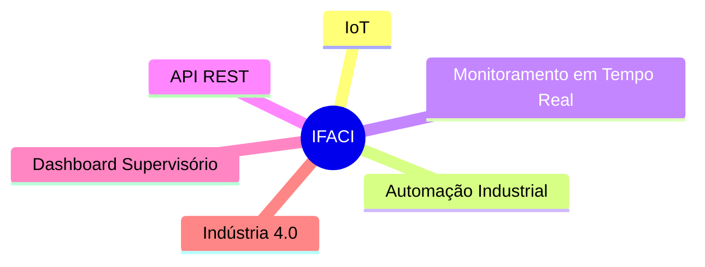
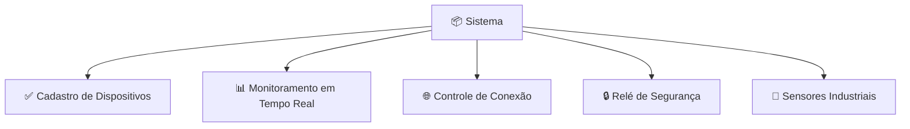
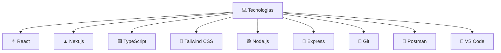
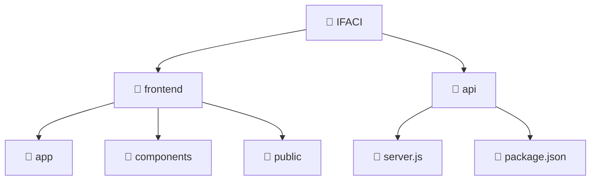
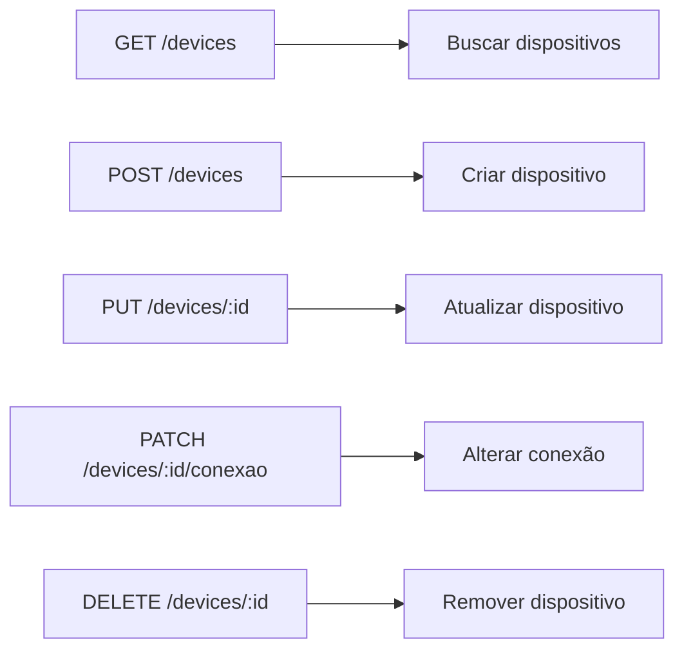
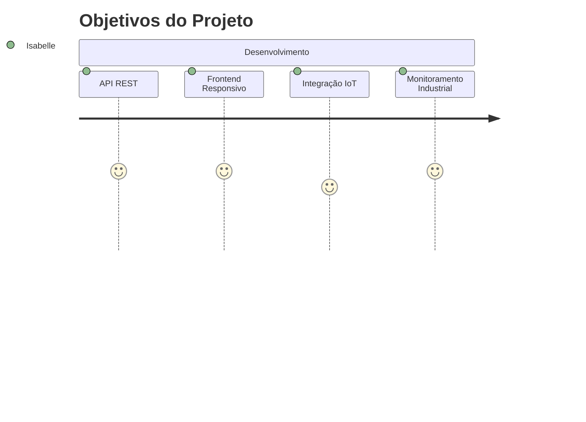
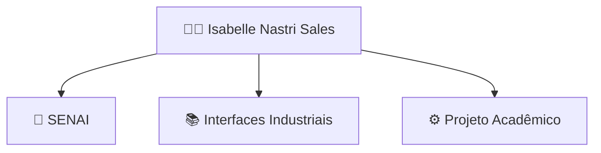
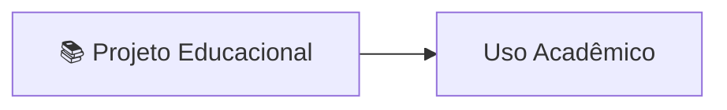

# IFACI - Sistema Supervisório Industrial


A["🌐 Frontend <br> Next.js + React"] -->|"API REST"| B["⚙️ Backend <br> Node.js + Express"]

B --> C["🏭 Dispositivos Industriais"]

C --> D["🌡️ Temperatura"]
C --> E["💨 Pressão"]
C --> F["💧 Umidade"]
C --> G["📡 Sensor de Presença"]
C --> H["🔒 Relé de Segurança"]
```

---

# 📖 Sobre o Projeto



---

# 🧠 Funcionalidades



---

# 🛠️ Tecnologias Utilizadas



---

# 📂 Estrutura do Projeto



---

# ▶️ Como Executar

## ⚙️ Backend

```bash
cd api
npm install
npm start
```

API:
```bash
http://localhost:8081
```

---

## 🎨 Frontend

```bash
cd frontend/my-app
npm install
npm run dev
```

Aplicação:
```bash
http://localhost:3000
```

---

# 🔗 Endpoints



---

# 📦 Exemplo JSON

```json
{
  "id": "EQP-001",
  "nome": "Sensor Industrial",
  "statusDispositivo": "online",
  "conexaoAtiva": true,
  "travaLiberada": false,
  "sensores": {
    "temperatura": 25,
    "pressao": 2.4,
    "umidade": 50,
    "sensorPresenca": true
  }
}
```

---

# 🎯 Objetivo



---

# 👩‍💻 Autor



---

# 📄 Licença


