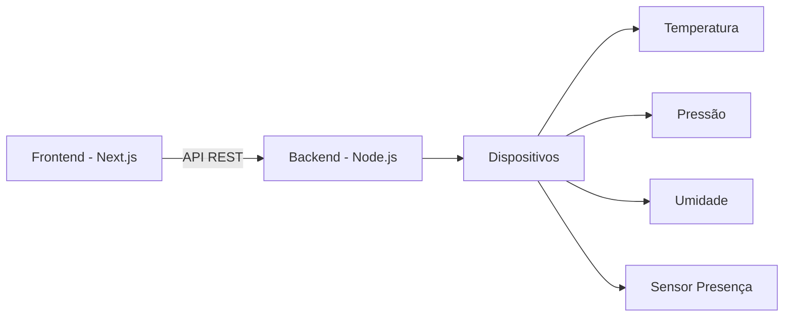
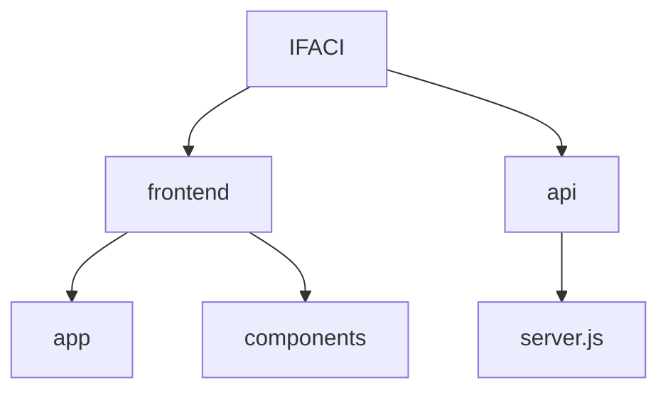

# 🚀 IFACI - Sistema Supervisório Industrial

<p align="center">
  
  
  
  
</p>

---

# Sobre o Projeto

O **IFACI** é uma plataforma web desenvolvida para monitoramento de dispositivos industriais em tempo real utilizando conceitos de:

- Automação Industrial
- Internet das Coisas (IoT)
- Indústria 4.0
- Sistemas Supervisórios
-  API REST

---

# Funcionalidades

- Cadastro de dispositivos
- Monitoramento em tempo real
- Sensores industriais simulados
- Controle de conexões
- Relé de segurança
- Integração frontend + backend

---

# Arquitetura do Projeto



---

# Tecnologias Utilizadas

## Frontend
- Next.js
- React.js
- TypeScript
- Tailwind CSS

## Backend
- Node.js
- Express.js

## Ferramentas
- Git
- GitHub
- Postman
- VS Code

---

# Estrutura do Projeto



---

# Como Executar

## Backend

```bash
cd api
npm install
npm start
```

API disponível em:

```bash
http://localhost:8081
```

---

## Frontend

```bash
cd frontend/my-app
npm install
npm run dev
```

Aplicação disponível em:

```bash
http://localhost:3000
```

---

# 🔗 Endpoints

| Método | Endpoint | Função |
|---|---|---|
| GET | `/devices` | Buscar dispositivos |
| POST | `/devices` | Criar dispositivo |
| PUT | `/devices/:id` | Atualizar dispositivo |
| PATCH | `/devices/:id/conexao` | Alterar conexão |
| DELETE | `/devices/:id` | Remover dispositivo |

---

# 📦 Exemplo JSON

```json
{
  "id": "EQP-001",
  "nome": "Sensor Industrial",
  "statusDispositivo": "online",
  "conexaoAtiva": true,
  "travaLiberada": false,
  "sensores": {
    "temperatura": 25,
    "pressao": 2.4,
    "umidade": 50
  }
}
```

---

# 🎯 Objetivo

Desenvolver uma plataforma supervisória industrial moderna baseada em conceitos de IoT e Indústria 4.0.

---

# 👩‍💻 Autor

**Isabelle Nastri Sales**  
🏫 SENAI - Interfaces Industriais
